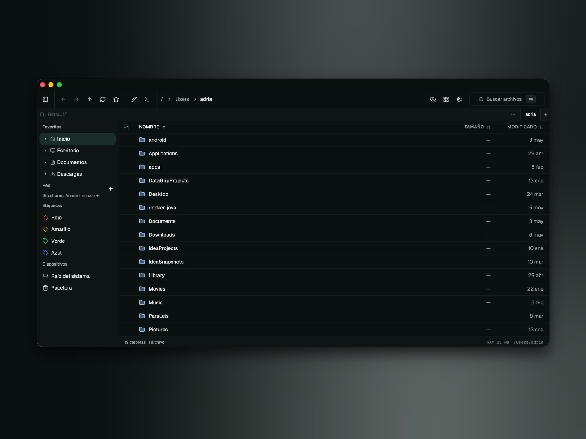

# Kenafold

A fast, keyboard-driven file manager for macOS, built with Tauri 2 + React 19.



---

## Features

- **Dual-pane layout** with multi-tab navigation per pane
- **List & grid view** with virtualised rendering for large directories
- **Inline quick filter** — type to filter without leaving the keyboard
- **Preview pane** — images, video, PDF, code with syntax highlight (shiki), archives
- **Full keyboard control** — configurable hotkeys for every action
- **File operations** — copy, move, rename, delete (to Trash), with undo
- **Bulk rename** — regex/pattern tokens (`{n}`, `{ext}`, `{date}`) with live preview
- **Tags** — color-coded labels stored in SQLite, filterable from the sidebar
- **Archive support** — compress/decompress zip, tar.zst, tar.gz, tar.bz2 with progress
- **Folder comparator** — diff two directories by size, mtime, and SHA-256 hash
- **Disk usage panel** — treemap visualisation (à la Disk Inventory X)
- **Git-aware badges** — modified / staged / untracked markers on files inside repos _(in progress)_
- **SMB / network shares** — mount and browse shares from the sidebar
- **Native macOS notifications** — on long copy / archive operations
- **Onboarding tour** — first-run highlight of key features

---

## Requirements

| Tool  | Version             |
| ----- | ------------------- |
| macOS | 13 Ventura or later |
| Rust  | stable (latest)     |
| Node  | 20+                 |
| Bun   | 1.x                 |

---

## Development

```bash
# Install dependencies
bun install

# Start the full Tauri dev app (Rust + frontend hot-reload)
bun run tauri dev

# Frontend only (port 1420)
bun run dev

# Type-check
bun run typecheck

# Lint
bun run lint

# Tests
bun run test
```

> **Note:** never run `bun run build` directly — use `bun tauri build` for production.

---

## Project structure

```
src/
  features/
    file-explorer/   # main pane, selection, view modes, drag-drop
    filesystem/      # file ops, undo stack, directory listing
    hotkeys/         # global hotkey registry + user-configurable bindings
    navigation/      # history (back/forward), favorites
    search/          # full-text search palette (calls Rust grep)
    settings/        # user preferences panel
    sidebar/         # favorites + SMB shares
    smb/             # SMB/network share mounting
    tags/            # color-coded tags (SQLite)
  shared/
    lib/             # cross-feature pure utilities
    tauri/           # shared Tauri helpers
  components/ui/     # shadcn primitives

src-tauri/src/
  archive.rs         # compress / decompress (zip, tar.zst, tar.gz, tar.bz2)
  comparator.rs      # folder diff
  fs.rs              # file operations + directory listing
  grep.rs            # ripgrep integration
  hash.rs            # SHA-256 / SHA-1 / MD5
  preview.rs         # file preview (text, image, PDF, video, archive listing)
  search.rs          # full-text search
  tags.rs            # SQLite tag storage
  watcher.rs         # FSEvents directory watcher
```

---

## Tech stack

| Layer                   | Tech                                                        |
| ----------------------- | ----------------------------------------------------------- |
| Frontend                | React 19, TypeScript, Vite 7, TailwindCSS 4                 |
| UI components           | shadcn/ui (Radix UI), lucide-react, Iconify (VS Code icons) |
| Tables / virtual scroll | TanStack Table + TanStack Virtual                           |
| Hotkeys                 | TanStack Hotkeys                                            |
| Drag & drop             | dnd-kit                                                     |
| Syntax highlight        | shiki (lazy-loaded)                                         |
| Charts                  | Recharts                                                    |
| Backend                 | Rust, Tauri 2                                               |
| Package manager         | Bun                                                         |
| Tests                   | Vitest + @testing-library/react                             |

---

## License

MIT
